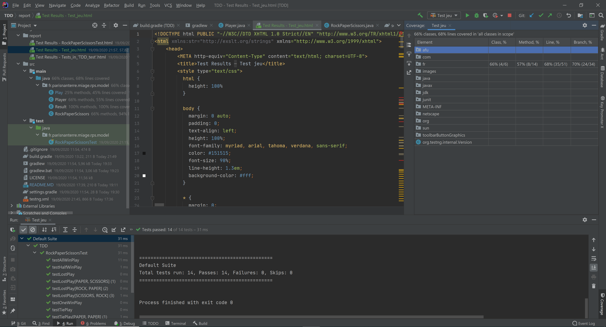
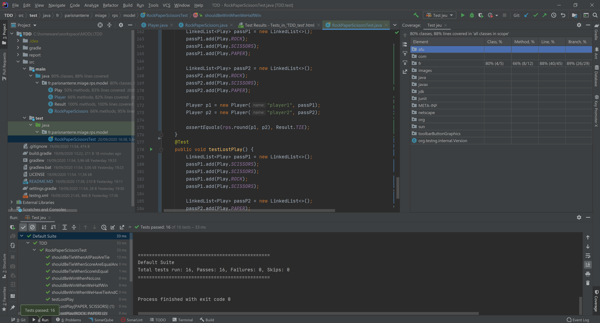
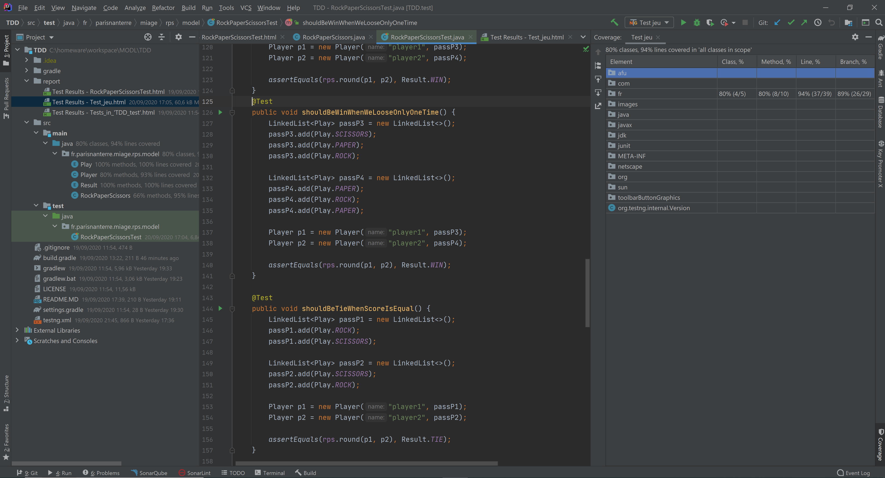
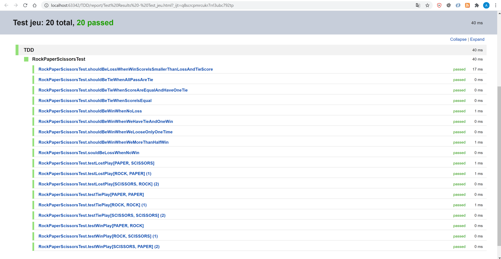

Module : Méthodes et outils du developpement logiciel

Chapitre : Tests & Qualité du code

TD : Pièrre-Papier-Ciseaux 

Objectif : Intro au Test Driven Development (TDD) avec Java/Gradle/TestNG/JaCoCo.

## III - Captures

- 

- 

- 

- 

